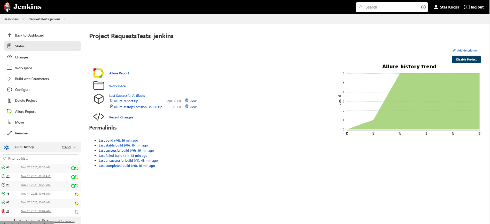
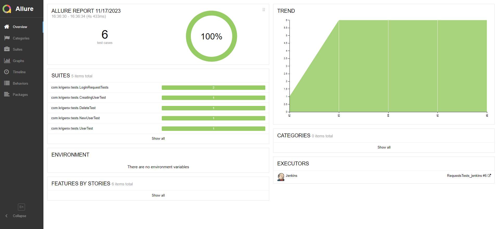
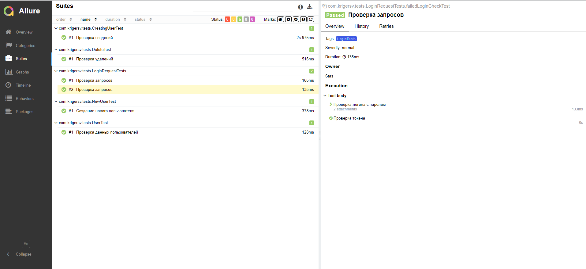
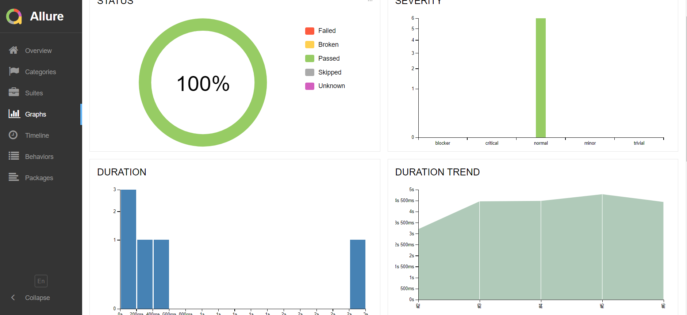
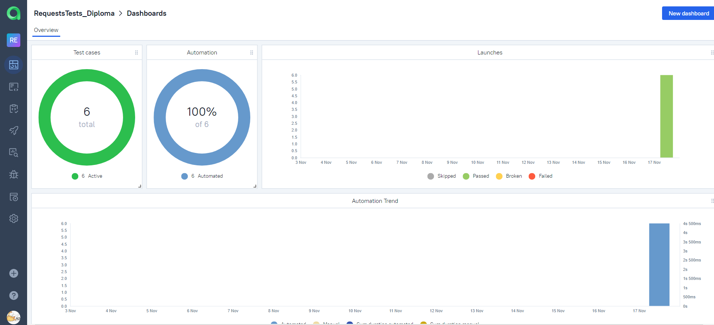
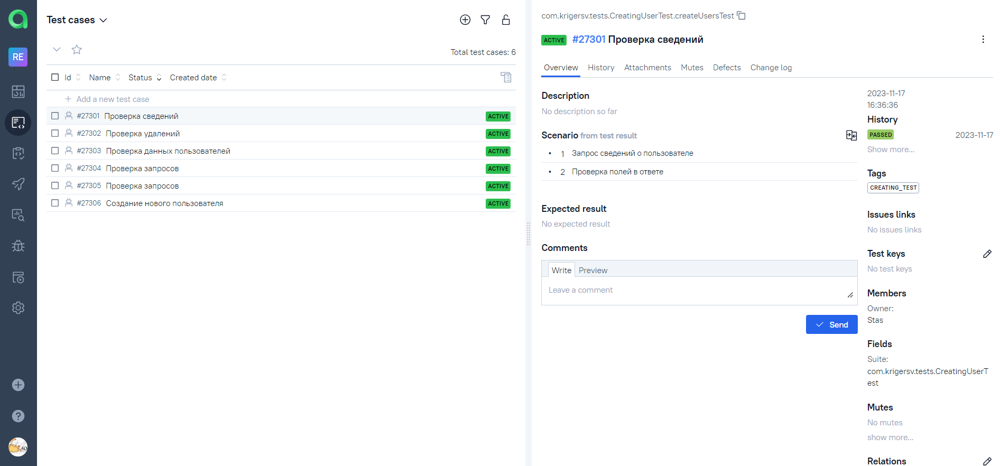
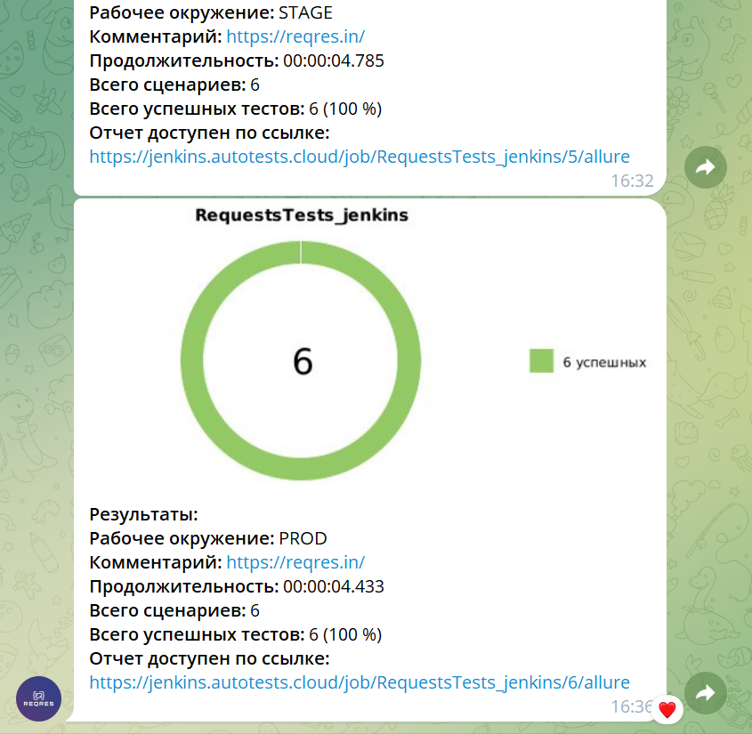

<h2 align="center"> Проект по автоматизации тестирования API для сайта сайта <a target="_blank" href="https://reqres.in/">reqres.in </a> </h2>

<a target="_blank" href="https://reqres.in/">
<p align="center">
  
</p></a>

## :green_book:	Содержание


> ➠ [Стек технологий](#classical_building-стек-технологий)
>
> ➠ [Реализованные проверки](#earth_africa-реализованные-проверки)
>
> ➠ [Запуск тестов из терминала](#запуск-тестов-из-терминала)
>
> ➠ [Запуск тестов из Jenkins](#запуск-тестов-из-jenkins)
>
> ➠ [Отчет о результатах тестирования в Allure Report](#skier-главная-страница-allure-отчета)
>
> ➠ [Интеграция с Allure TestOps](#интеграция-с-allure-testops)
> 
> ➠ [Уведомления в Telegram с использованием бота](#-уведомления-в-telegram-с-использованием-бота)


## :classical_building: Стек технологий

<p align="center">


</p>

## :earth_africa: Реализованные проверки

1. - :heavy_check_mark:_Проверка сведений о пользователе_
2. - :heavy_check_mark:_Проверка удалений_
3. - :heavy_check_mark:_Проверка запросов_
4. - :heavy_check_mark:_Создание нового пользователя_
5. - :heavy_check_mark:_Проверка данных пользователей_

## Запуск тестов из терминала

### :robot: Команда запуска тестов:

```
gradle clean test 
-Dhost=local
```


###  Сборка в [Jenkins](https://jenkins.autotests.cloud/job/RequestsTests_jenkins)

<p align="center">
  
</p>

##  [Allure](https://jenkins.autotests.cloud/job/RequestsTests_jenkins/10/allure/) отчет
### :skier: Главная страница Allure-отчета

<p align="center">

</p>

### :eye_speech_bubble: Тест-кейсы

<p align="center">

</p>

### :frog: Основной Dashboard

<p align="center">

</p>

##  Интеграция с [Allure TestOps](https://allure.autotests.cloud/launch/32178/tree?treeId=0)
### :skier: Dashboard Allure TestOps

<p align="center">

</p>

### :eye_speech_bubble: Тест-кейсы

<p align="center">

</p>

##  Уведомления в Telegram с использованием бота

> После завершения сборки специальный бот, созданный в <code>Telegram</code>, автоматически обрабатывает и отправляет сообщение с отчетом о прохождении тестов.

<p align="center">

</p>


